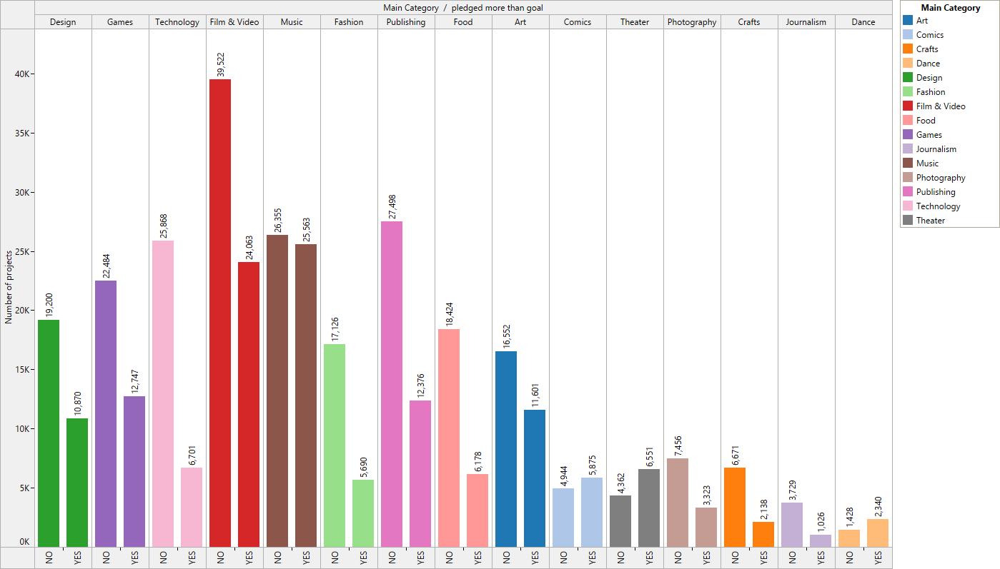
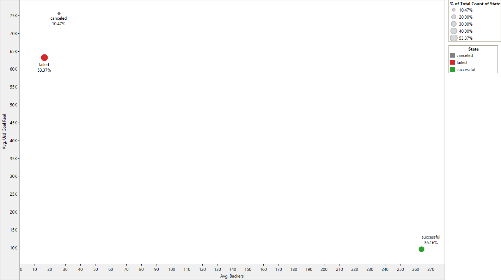

  

<h3 align="center">
  Kickstarter analysis
</h3>
 

## Table of Contents

- [Exploratory Data Analysis and Data Cleaning](#EDA-and-Cleaning)
- [Regression Modelling](#Regression-Modelling)
- [Other](#Other)

## EDA and Cleaning

#### Fund raisers for start ups from across the globe

    

#### Category-wise distribution
Ranking of the most backed categories

    

Ranking of the most launched categories

    

Top 50 of the most launched sub-categories

    

Funds raised (Sum) by category and sub category

    

Funds raised (Sum) by main category

    

Funds raised (Average) by main category

    

Top 5 sub-categories raised in Design, Games and Technology

    

Fund Raising status in history of Kickstarter

    

Average length of campaigns (nb of days) that have seen different fates

    

Top 15 projects

    

Top 50 projects by highest backers

    

Average days to reach Average goal funding - Category-wise

    

Category-wise Success/Failure

    

Pledged more than goal (yes/no) by category

    

Average successfully Pledged vs Currency (USD equivalent) 

    

Number of days distribution
- removed 1 outlier that lasted 16.000 days

    

Average funds raised per backer in different categories

    

Average Backers v Average Goal for Successful/failed/cancelled campaigns

    

## Regression Modelling

Coming...

 

## Other

Coming...