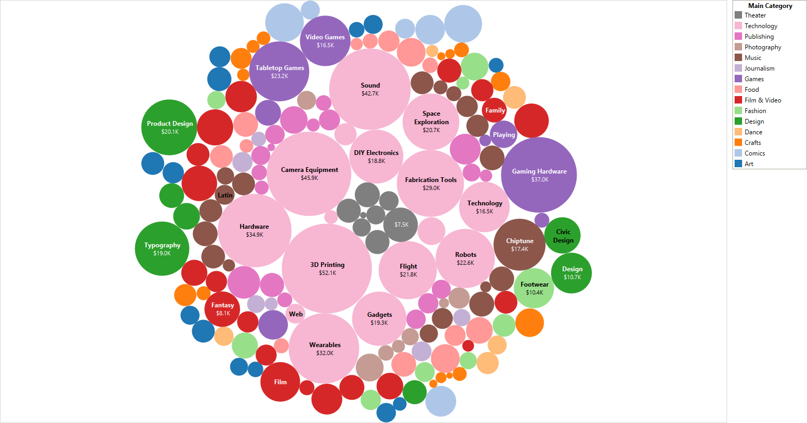

  

<h3 align="center">
  Kickstarter analysis
</h3>
 

## Table of Contents

- [Exploratory Data Analysis and Data Cleaning](#EDA-and-Cleaning)
- [Regression Modelling](#Regression-Modelling)
- [Other](#Other)

## EDA and Cleaning

#### Fund raisers for start ups from across the globe

    

#### Category-wise distribution
Ranking of the most backed categories

    

Ranking of the most launched categories

    

Top 50 of the most launched sub-categories

    

Funds raised (Sum) by category and sub category

    

Funds raised (Sum) by main category

    

Funds raised (Average) by main category

    

Top 5 sub-categories raised in Design, Games and Technology

    

Fund Raising status in history of Kickstarter

    

Average length of campaigns (nb of days) that have seen different fates

    

Top 15 projects

    

Top 50 projects by highest backers

    

## Regression Modelling

Coming...

 

## Other

Coming...